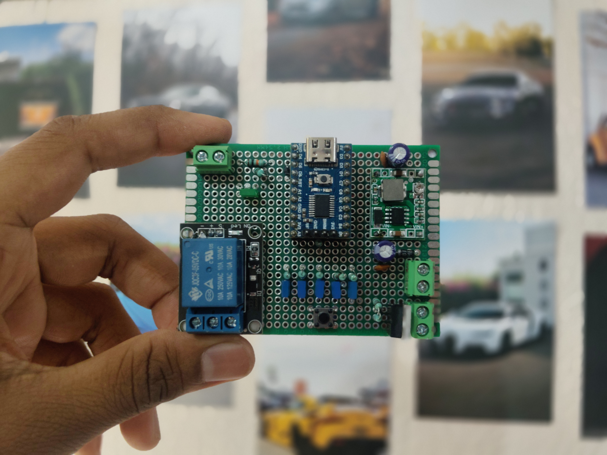

# QuickShifter

### A precision-timed QuickShifter controller built from scratch using STM8S003F3P6



This project started with a simple requirement: build a QuickShifter module that can control a relay for a precisely defined amount of time.

At first, the problem looks almost too simple:

```text
Trigger → Relay ON → Wait → Relay OFF
```

But once the system has to operate reliably on real hardware, timing, switch bounce, repeated triggers, unexpected states, configuration storage, fault recovery, and watchdog behavior all become part of the problem.

This project was built around that idea. Instead of using a blocking delay-based firmware, the QuickShifter was developed as a small, modular embedded system with a timer-driven architecture, state machines, persistent configuration, user feedback, and multiple layers of fault handling.

---

## Project Overview

The QuickShifter uses an **STM8S003F3P6** microcontroller to detect a shift trigger and activate a relay for a selectable cut duration.

Five operating modes are currently available:

| Mode   | Cut Time |
| ------ | -------: |
| Mode 1 |    40 ms |
| Mode 2 |    50 ms |
| Mode 3 |    60 ms |
| Mode 4 |    70 ms |
| Mode 5 |    80 ms |

The selected mode can be changed using a dedicated button. LEDs indicate the currently selected mode, while a passive buzzer provides audible feedback for startup, mode changes, shifts, ready states, and faults.

The firmware also stores the selected configuration in EEPROM so the selected mode can persist across resets.

The main design goal was to keep the system **small, deterministic, and easy to reason about** rather than using a more powerful microcontroller than the application actually requires.

---

## Hardware

The heart of the system is the **STM8S003F3P6**, running from its internal 16 MHz HSI oscillator. The MCU handles the complete application: input processing, timing, relay control, configuration management, LEDs, buzzer generation, debugging, and watchdog supervision.

The relay is connected to the MCU through the relay-control output and acts as the primary actuator. The shift trigger and mode-selection button use GPIO inputs with internal pull-ups, meaning the inputs remain HIGH when idle and are pulled LOW when the corresponding switch is pressed.

The user interface consists of five individual mode LEDs and a separate RGB status LED. A passive buzzer provides audible feedback and is driven through a BC547 transistor so that the MCU GPIO does not have to directly drive the buzzer load.

The hardware also exposes UART debugging through the STM8 UART1 peripheral. During development, an ESP8266 NodeMCU board was used as a USB-to-UART interface so that debug information could be monitored on a PC.

---

## Hardware Pin Configuration

The current documented hardware allocation is:

| STM8 Pin                | Function                                      |
| ----------------------- | --------------------------------------------- |
| PD2                     | Relay output                                  |
| PD3                     | QuickShifter trigger input                    |
| PD4                     | Mode-selection button                         |
| PD5                     | UART1 TX                                      |
| PD6                     | UART1 RX, currently unused                    |
| PD6 / A1 / C3 / C4 / C5 | Mode LED outputs as documented in the project |
| PB4                     | RGB LED Red                                   |
| PC6                     | RGB LED Green                                 |
| PC7                     | RGB LED Blue                                  |
| PA3                     | Passive buzzer driver                         |

The exact hardware configuration should always be checked against the latest source files and circuit documentation before building another hardware revision.

---

# Firmware Architecture

The firmware is written in **Embedded C** and is implemented directly around the STM8 peripherals and registers.

There is no Arduino framework involved and no large external firmware framework controlling the application. Hardware functionality is separated into small modules so that the application logic does not need to directly manipulate every peripheral register.

The architecture roughly follows:

```text
                         main()
                           │
                           ▼
                  Application Layer
                           │
              ┌────────────┴────────────┐
              │                         │
              ▼                         ▼
       QuickShifter FSM            Mode Manager
              │                         │
              ├──────────────┐          │
              ▼              ▼          ▼
        Button Driver   Software Timer  EEPROM
              │              │
              └───────┬──────┘
                      ▼
                 Timer Driver
                      │
                      ▼
                   TIM4
                      │
                      ▼
                1 ms System Tick

Additional services:
LED Driver ──► User feedback
Buzzer Driver ──► Audible feedback
UART/Debug ──► Development diagnostics
Watchdog ──► Firmware recovery
```

The main loop is cooperative and non-blocking. Instead of stopping execution for tens of milliseconds while waiting for a relay timer to expire, the firmware starts a software timer and continues executing the rest of the application.

This allows the buttons, state machine, buzzer, and watchdog to continue operating while the relay timing is in progress.

---

# Clock and Timer System

The STM8S003F3 initially operates from its internal **16 MHz HSI oscillator** with a default divider. The firmware configures the clock divider so that the MCU operates at the full 16 MHz.

```c
CLK_CKDIVR = 0x00;
```

The system uses **TIM4** as the main timing foundation.

TIM4 is configured with:

```text
CPU Clock     : 16 MHz
Prescaler     : 128
Timer Clock   : 125 kHz
Auto Reload   : 124
Tick          : 1 ms
```

Every TIM4 update interrupt increments a global system tick.

```c
volatile uint32_t system_tick;
```

This provides a common time reference for the rest of the firmware.

The important idea here is that the QuickShifter does not depend on large blocking delays such as:

```c
Timer_Delay(70);
```

for application timing.

Instead, the firmware can start a timer and check whether it has expired while continuing to execute other tasks.

---

# Software Timer

The software timer module is built on top of the 1 ms system tick.

A software timer contains:

```c
typedef struct
{
    uint32_t start_time;
    uint32_t duration;
    uint8_t active;

} SoftwareTimer_t;
```

The main API is:

```c
SoftwareTimer_Start();
SoftwareTimer_Stop();
SoftwareTimer_Expired();
SoftwareTimer_IsRunning();
```

This allows multiple independent timing operations to exist without requiring a separate hardware timer for every function.

For example, the relay cut timer and cooldown timer can use the same system tick while remaining logically independent.

---

# QuickShifter State Machine

The QuickShifter itself is implemented as a **finite state machine** rather than a collection of unrelated delays and `if` statements.

The normal operating sequence is:

```text
                 ┌──────────────┐
                 │     IDLE     │
                 └──────┬───────┘
                        │
                  Shift detected
                        │
                        ▼
                 ┌──────────────┐
                 │ CUT_ACTIVE   │
                 └──────┬───────┘
                        │
                   Timer expires
                        │
                        ▼
                 ┌──────────────┐
                 │  COOLDOWN    │
                 └──────┬───────┘
                        │
                 Cooldown expires
                        │
                        ▼
                 ┌──────────────┐
                 │ WAIT_RELEASE │
                 └──────┬───────┘
                        │
                  Button released
                        │
                        ▼
                 ┌──────────────┐
                 │     IDLE     │
                 └──────────────┘
```

The firmware also contains fault handling that forces the system toward a known safe condition.

The main QuickShifter task is implemented through:

```c
QuickShifter_Init();
QuickShifter_Task();
```

When a valid shift is detected, the relay is activated and the selected cut-time timer is started.

When that timer expires, the relay is explicitly turned OFF.

After that, the firmware enters a cooldown period before waiting for the original trigger to be released.

This prevents one long button press or mechanical vibration from producing multiple cuts.

The important safety principle throughout the state machine is:

```text
Unexpected condition
        ↓
    Relay OFF
        ↓
  Known firmware state
```

---

# Button Driver

Mechanical buttons do not produce a perfectly clean HIGH-to-LOW transition. They bounce electrically for a short period when pressed or released.

The button driver therefore uses its own state machine:

```text
RELEASED
    │
    ▼
DEBOUNCE_PRESS
    │
    ▼
PRESSED
    │
    ▼
DEBOUNCE_RELEASE
    │
    ▼
RELEASED
```

A software timer is used for the debounce period rather than blocking the CPU.

The button module provides:

```c
Button_Init();
Button_Update();
Button_GetPress();

ModeButton_Init();
ModeButton_Update();
ModeButton_GetPress();
```

The driver also converts a physical press into a one-shot logical event. This means one physical button press produces one application event instead of repeatedly triggering the QuickShifter while the button remains pressed.

---

# Operating Modes

The QuickShifter supports five selectable cut durations:

```text
Mode 1 → 40 ms
Mode 2 → 50 ms
Mode 3 → 60 ms
Mode 4 → 70 ms
Mode 5 → 80 ms
```

The mode manager is implemented in:

```text
mode.c
mode.h
```

The main functions are:

```c
Mode_Init();
Mode_Next();
Mode_Get();
Mode_GetCutTime();
```

The modes wrap around continuously:

```text
Mode 1
  ↓
Mode 2
  ↓
Mode 3
  ↓
Mode 4
  ↓
Mode 5
  ↓
Mode 1
```

The selected mode is kept separate from the actual timer implementation. The mode manager decides **what timing should be used**, while the timer system is responsible for **measuring that timing**.

This separation makes the firmware easier to modify and test.

---

# EEPROM Configuration

The selected mode is stored in the STM8 EEPROM so that configuration can persist between resets.

The EEPROM implementation does more than simply write a number and hope for the best.

The configuration contains a magic value, mode value, and checksum. The firmware validates the stored information before accepting it.

Conceptually:

```text
Read EEPROM
     │
     ├── Magic
     ├── Mode
     └── Checksum
           │
           ▼
      Validate data
           │
      ┌────┴────┐
      ▼         ▼
   Valid      Invalid
      │         │
      ▼         ▼
   Accept    Default mode
```

The checksum is calculated from the stored configuration, allowing simple data corruption to be detected.

The firmware also verifies EEPROM writes by reading the data back after programming.

An important part of the implementation is that the watchdog remains active during blocking EEPROM operations. Instead of disabling the watchdog while EEPROM operations are taking place, the EEPROM driver services the watchdog during the operation.

---

# Watchdog and Fault Handling

The STM8 Independent Watchdog provides a final recovery mechanism if the firmware becomes stuck.

The application initializes and refreshes it using:

```c
Watchdog_Init();
Watchdog_Refresh();
```

The normal main loop continuously refreshes the watchdog.

If the firmware becomes trapped in an unexpected infinite loop or otherwise stops servicing the watchdog, the IWDG eventually resets the MCU.

The watchdog is not being used as a replacement for proper firmware design. It is the last line of defense against firmware execution failure.

The project also includes deliberate watchdog fault-injection testing where watchdog refreshing was intentionally stopped to verify that the MCU actually resets.

Another important detail is that blocking EEPROM and UART operations were made watchdog-aware. This prevents legitimate lengthy operations from accidentally causing a watchdog reset while still allowing the watchdog to recover the system from a genuine firmware lock-up.

---

# LED Driver

The LED subsystem provides visual feedback without requiring an external GPIO expander.

Five LEDs represent the five QuickShifter modes:

```text
Mode 1 → 40 ms
Mode 2 → 50 ms
Mode 3 → 60 ms
Mode 4 → 70 ms
Mode 5 → 80 ms
```

The LED functionality is contained in:

```text
led.c
led.h
```

The main interface includes:

```c
LED_Init();
LED_Mode_Display();
```

A separate RGB LED provides system-level status indication.

The RGB channels are controlled directly through STM8 GPIO pins, keeping the implementation simple and deterministic.

---

# Passive Buzzer

The project uses a **passive buzzer** rather than simply switching an active buzzer ON and OFF.

A passive buzzer requires an alternating waveform, so the firmware generates a square wave whose frequency determines the perceived pitch.

The final design uses a **BC547 NPN transistor** as a low-side driver between the MCU and the buzzer.

```text
STM8 GPIO
    │
   1 kΩ
    │
 BC547 Base
    │
 BC547 Collector
    │
 Passive Buzzer
    │
   +5V
```

The buzzer waveform is generated using **TIM2**. The timer interrupt toggles the buzzer output, producing the required square wave.

The buzzer software also contains a small melody engine based on notes containing:

```c
frequency
duration
```

This allows events such as startup, mode changes, quick shifts, ready status, and faults to have their own audible feedback.

The melody engine is designed to be non-blocking so that audio feedback does not interfere with the QuickShifter timing logic.

The main buzzer functions include:

```c
Buzzer_Init();
Buzzer_Play();
Buzzer_Task();
Buzzer_TickISR();
```

---

# UART Debugging

During development, UART was added to make firmware behavior easier to observe.

The debug architecture is separated into two layers:

```text
Application
    ↓
debug.c / debug.h
    ↓
uart.c / uart.h
    ↓
STM8 UART1
```

This means application code can use:

```c
Debug_Log();
Debug_LogState();
Debug_LogShift();
Debug_LogMode();
```

without directly accessing UART registers.

The current UART debug configuration is:

```text
Baud Rate : 9600
Data      : 8 bits
Parity    : None
Stop      : 1
```

UART debugging was tested using an ESP8266 NodeMCU board as a temporary USB-to-UART interface and monitored on a PC.

Debugging can also be disabled for a production build using the debug configuration macro, allowing the application to remain independent from the development UART interface.

---

# Main Application Flow

The main application initializes the system in a controlled sequence:

```text
Clock
  ↓
Timer
  ↓
Buttons
  ↓
Mode Button
  ↓
Debug
  ↓
LED
  ↓
Buzzer
  ↓
EEPROM
  ↓
Mode
  ↓
QuickShifter
  ↓
Watchdog
  ↓
Main Loop
```

The main loop then continuously services the different modules:

```c
while(1)
{
    Button_Update();
    ModeButton_Update();

    QuickShifter_Task();

    Buzzer_Task();

    Watchdog_Refresh();
}
```

Mode changes are handled as events. When a valid mode-button press is detected, the firmware advances to the next mode, updates the mode LED, plays the corresponding buzzer feedback, and reports the new configuration through the debug interface when debugging is enabled.

---

# Software Stack

The project is intentionally lightweight and close to the hardware.

**Language:** Embedded C

**Target MCU:** STM8S003F3P6

**Clock:** 16 MHz internal HSI

**Hardware peripherals:** GPIO, TIM4, TIM2, UART1, EEPROM, Independent Watchdog

**Firmware architecture:** Modular, cooperative, non-blocking application with finite state machines and software timers

**Debug interface:** UART1 → USB-UART → PC

**User interface:** Push buttons, five mode LEDs, RGB status LED and passive buzzer

The repository contains the STM8 development project files and the complete C/H source modules used to implement the firmware.

---

# Source Code Structure

The repository is divided into small modules instead of keeping the complete firmware inside `main.c`.

```text
QuickShifters/
│
├── images/
│   └── Hardware.jpg
│
├── main.c
│
├── gpio.c / gpio.h
├── clock.c / clock.h
├── timer.c / timer.h
├── software_timer.c / software_timer.h
│
├── button.c / button.h
├── quickshifter.c / quickshifter.h
├── mode.c / mode.h
│
├── relay.c / relay.h
├── led.c / led.h
├── buzzer.c / buzzer.h
│
├── eeprom.c / eeprom.h
├── watchdog.c / watchdog.h
│
├── uart.c / uart.h
├── debug.c / debug.h
│
├── stm8_hw.h
├── stm8_interrupt_vector.c
├── common.h
├── config.h
│
├── 01_GPIO.md
├── 02_stateMachine.md
├── 03_ModeSelection.md
├── 04_firmwareSafety.md
├── 05_led&Buzzer_Driver.md
└── pin_config.md
```

The individual modules have clear responsibilities.

`quickshifter.c` contains the core QuickShifter state machine. `button.c` handles physical input and debouncing. `mode.c` handles the five operating modes. `software_timer.c` provides reusable timing functionality on top of the system tick.

`relay.c`, `led.c`, and `buzzer.c` handle the physical outputs, while `eeprom.c` manages persistent configuration. `watchdog.c` handles the Independent Watchdog and `debug.c`/`uart.c` provide the development-time debugging interface.

This separation keeps the application logic independent from most low-level hardware details.

---

# Important Firmware APIs

Some of the main interfaces exposed by the firmware are:

```c
// Clock
CLK_Init();

// Timer
Timer_Init();
Timer_GetTick();
Timer_Delay();

// Software Timer
SoftwareTimer_Start();
SoftwareTimer_Stop();
SoftwareTimer_Expired();
SoftwareTimer_IsRunning();

// Buttons
Button_Init();
Button_Update();
Button_GetPress();

ModeButton_Init();
ModeButton_Update();
ModeButton_GetPress();

// QuickShifter
QuickShifter_Init();
QuickShifter_Task();

// Modes
Mode_Init();
Mode_Next();
Mode_Get();
Mode_GetCutTime();

// EEPROM
EEPROM_Init();

// LEDs
LED_Init();
LED_Mode_Display();

// Buzzer
Buzzer_Init();
Buzzer_Play();
Buzzer_Task();
Buzzer_TickISR();

// Watchdog
Watchdog_Init();
Watchdog_Refresh();

// Debug
Debug_Init();
Debug_Log();
Debug_LogState();
Debug_LogShift();
Debug_LogMode();
```

These interfaces allow the application layer to interact with the hardware modules without directly depending on their internal implementation.

---

# Safety Philosophy

The most important design rule in the firmware is simple:

> **If something unexpected happens, the relay should end up OFF.**

This principle appears in multiple places in the firmware.

During startup, the relay is initialized into a known state. During normal operation, the relay is explicitly turned OFF when the cut timer expires. During invalid state recovery, the relay is also forced OFF before the state machine returns to a known state.

Other layers provide additional protection:

```text
Button noise
    ↓
Debounce

Repeated trigger
    ↓
One-shot event + state machine

Relay timing
    ↓
Software timer

Rapid retriggering
    ↓
Cooldown

Held trigger
    ↓
WAIT_RELEASE

Invalid configuration
    ↓
EEPROM validation

Firmware lock-up
    ↓
Independent Watchdog
```

The intention is not to make the firmware complicated for the sake of complexity. Each layer exists because it solves a different failure mode.

---

# Development and Testing

The firmware was developed incrementally rather than attempting to build the complete system in one step.

The initial hardware verified basic GPIO operation and relay control. The firmware was then moved from blocking delays to a timer-driven architecture. TIM4 was verified using the system tick, and the software timer system was introduced.

The QuickShifter state machine and non-blocking button driver were then added, followed by the five configurable modes and EEPROM persistence.

UART debugging was added to make development and troubleshooting easier. The LED and buzzer system was developed separately and integrated into the main application afterward.

The watchdog was also tested through deliberate fault injection to confirm that a firmware execution failure results in an MCU reset.

During development, several real hardware/firmware issues were encountered and resolved, including GPIO abstraction problems, buzzer drive limitations, timer/interrupt behavior, EEPROM interaction with the watchdog, and UART debugging configuration.

This repository contains the development notes documenting those stages in more detail.

---

# Documentation

The project includes dedicated documentation for the major firmware subsystems:

* [`01_GPIO.md`](01_GPIO.md) — GPIO abstraction and hardware configuration
* [`02_stateMachine.md`](02_stateMachine.md) — Timer architecture, software timers, state machines and non-blocking firmware
* [`03_ModeSelection.md`](03_ModeSelection.md) — UART debugging, mode selection and configurable timing
* [`04_firmwareSafety.md`](04_firmwareSafety.md) — Safety, EEPROM validation, watchdog and fault handling
* [`05_led&Buzzer_Driver.md`](05_led%26Buzzer_Driver.md) — LED and passive buzzer architecture
* [`pin_config.md`](pin_config.md) — Hardware pin allocation

These documents provide a deeper look into how the firmware evolved and why particular implementation decisions were made.

---

# What Makes This Project Interesting?

The interesting part of this project isn't really the relay.

It's the engineering around it.

The system takes a simple real-world requirement and turns it into a small embedded architecture with deterministic timing, state-based control, persistent configuration, hardware feedback, debugging infrastructure and recovery mechanisms.

Instead of:

```text
Button
  ↓
delay()
  ↓
Relay
```

the final architecture is closer to:

```text
Physical Input
      ↓
Debounce State Machine
      ↓
One-Shot Event
      ↓
QuickShifter State Machine
      ↓
Software Timer
      ↓
Relay Control
      ↓
Cooldown
      ↓
Wait for Release
      ↓
Ready for Next Shift
```

And running alongside it are the watchdog, configuration system, LEDs, buzzer and debug infrastructure.

That was the main goal of the project: **not just making the relay work, but making the system behave predictably when the real world inevitably does something unexpected.**

---

# Current Status

The first working prototype has been developed and the core firmware architecture is operational.

The current implementation includes the five selectable cut modes, non-blocking timing, QuickShifter and button state machines, EEPROM configuration, watchdog supervision, LED feedback, buzzer feedback and UART debugging.

Further hardware refinement, validation and production-oriented improvements can be added as the project moves beyond the prototype stage.

---

## Author

**Rajkiran Shinde**

Embedded Systems | Firmware | Electronics

[GitHub](https://github.com/Rajkiran-Shinde)
---

## Disclaimer

This repository documents an embedded prototype developed for a real-world application. The firmware and hardware should be validated thoroughly against the final electrical and mechanical system before being used in a safety-critical or production environment.

---

### Built with C, registers, timers, state machines... and a questionable amount of debugging. 😄
